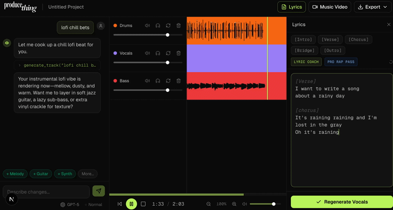

<h1 align="center">ProduceThing</h1>
<p align="center"><strong>Most AI music tools generate songs. ProduceThing helps you write better ones. It coaches lyrics in real time, then an autonomous agent arranges and refines them into a finished track.</strong></p>
<p align="center"><em>TreeHacks 2026</em></p>

<p align="center"></p>

---

## Technical Deep Dive

### 1. Parallelized Stem Separation Pipeline

The biggest UX bottleneck in stem separation is latency. Suno's `/stem` endpoint splits a track into 12 stems but takes 60-120s. We couldn't ship that wait time.

**Solution: Race two pipelines in parallel and deduplicate with a first-wins strategy.**

```
Track complete ──┬── Modal Demucs (T4 GPU, htdemucs) ── 3 stems in ~20s
                 │
                 └── Suno /stem API ───────────────── 12 stems in 60-120s
                                                        │
                              deliveredStems (Set) ◄────┘
                              First pipeline to deliver each stem wins.
```

**How it works:**

- After Suno generation completes (`status=complete`), we fire **both** pipelines simultaneously
- A `Set<StemType>` called `deliveredStems` tracks what's arrived — if Demucs delivers `drums` first, Suno's `drums` is silently dropped
- **Core stems** (drums, vocals, bass) buffer in a `pendingCore` Map. Once all 3 arrive — from whichever pipeline — we do an **atomic swap**: remove the full-mix placeholder layer, add 3 individual stem layers in one React state update. No flicker.
- **Non-core stems** (guitar, keyboard, strings, etc.) go to `stemCache` for instant manual adds later
- Demucs failure is swallowed with `.catch()` — Suno handles all 12 stems as fallback. **Zero degradation.**

**The Modal side:** Our `demucs_endpoint.py` runs `htdemucs` (Hybrid Transformer Demucs) on a T4 GPU with pre-downloaded weights baked into the container image — no runtime download delay. One warm instance stays alive (`keep_warm=1`) to eliminate cold starts.

**Result:** Users get their first playable stems in ~20s instead of 60-120s. The remaining 9 stems trickle in via Suno's progressive polling while the user is already mixing.

### 2. Lyric Analysis Engine

We built a real-time lyric analysis system that runs **entirely client-side** — no round-trip to an LLM for basic feedback. It catches problems as you type.

**Syllable counting** uses the `syllable` npm package for per-line cadence analysis. We feed this into a **cadence profiler** (`rap-theory.ts`) that computes avg/min/max syllables, variance, and classifies flow as "tight," "balanced," or "loose."

**Rhyme detection** uses a custom phonetic normalization pipeline:

```typescript
// English spelling is a disaster. We normalize before comparing.
const SUFFIX_NORMALIZATIONS: [RegExp, string][] = [
  [/ight$/, "ite"],   // "night" → "nite"
  [/ould$/, "ood"],   // "would" → "wood"
  [/tion$/, "shun"],  // "nation" → "nashun"
  [/sion$/, "shun"],  // "vision" → "vishun"
  [/ck$/, "k"],       // "rock" → "rok"
  // ... 6 more rules
];
```

After normalization, we extract the last 3 characters as a `rhymeKey` and cluster lines that share endings. Lines with ≥2 matches form rhyme groups — this feeds into an **ABAB rhyme scheme builder** that labels patterns across verses.

**Cliche detection** matches against 48 hardcoded phrases ("heart on my sleeve," "dance in the rain," etc.) and highlights them inline. **Filler word detection** flags weak words ("basically," "literally," "you know"). **Repetition tracking** tokenizes the full lyric, counts unigrams appearing ≥3x and n-grams (2-3 word phrases) appearing ≥2x, and annotates them with `"word" appears Nx` labels.

**On top of the client-side engine**, we have an LLM-powered insight layer (`/api/lyrics/analyze`) that uses GPT-4o-mini to generate thematic analysis, rhyme targets (5 rhymes per target word), and writing tips — with a graceful fallback so the panel never breaks if the LLM fails.

### 3. Dual-Model AI Routing + Agent Mode

We don't use one model for everything. Different tasks need different tradeoffs:

| Mode | Model | Why |
|------|-------|-----|
| **Normal** | GPT-5 Nano | Fast, cheap. Good for "add more bass" or "make it darker." Sub-second responses. |
| **Agent** | Claude Opus 4.6 | Powerful multi-step reasoning. Can compose an entire track autonomously from "make me a lo-fi hip hop beat." |

**The routing logic** is dead simple — if `agentMode` is true, we always use Claude. Otherwise, the user toggles between OpenAI and Anthropic.

**Agent mode is where it gets interesting.** Claude Opus operates in a **Plan → Execute → Observe → Reflect** loop:

1. **Plan**: The agent reasons about what a genre needs ("lo-fi hip hop typically has mellow drums, a jazzy bass, and vinyl-crackle FX")
2. **Execute**: Calls `generate_track` → waits for stem separation → chains `add_layer` calls for cached stems
3. **Observe**: Parses enriched tool results that include cached stem lists and layer counts
4. **Reflect**: Summarizes what was built and suggests next refinements

The loop is powered by Vercel AI SDK v6's `sendAutomaticallyWhen: lastAssistantMessageIsCompleteWithToolCalls` — when the assistant's response includes tool calls, the SDK automatically sends tool results back, creating a natural agent loop without custom orchestration.

**Critical implementation detail:** In agent mode, tool callbacks `await` the full Suno generation + stem separation pipeline and return detailed state. In normal mode, they fire-and-forget and return immediately. Same tools, different depth — because the agent needs rich context to chain decisions, but a human user just needs the UI to update.

**6 tools available**: `generate_track`, `add_layer`, `regenerate_layer`, `remove_layer`, `set_lyrics`, `get_composition_state`

---

## System Architecture

```
┌─────────────────────────────────────────────────────────────────────┐
│                        User (Browser)                               │
│                                                                     │
│  ┌──────────┐  ┌──────────┐  ┌───────────┐  ┌───────────────────┐  │
│  │ Chat     │  │ Layer    │  │ Waveform  │  │ Transport +       │  │
│  │ Panel    │  │ Sidebar  │  │ Display   │  │ Master Volume     │  │
│  │          │  │          │  │           │  │                   │  │
│  │ Drag a   │  │ Volume   │  │ waveform- │  │ Web Audio API     │  │
│  │ layer ──►│  │ Mute     │  │ playlist  │  │ (GainNode mixing) │  │
│  │ to chat  │  │ Solo     │  │ (canvas)  │  │                   │  │
│  └────┬─────┘  └──────────┘  └───────────┘  └───────────────────┘  │
│       │                                                             │
└───────┼─────────────────────────────────────────────────────────────┘
        │
        ▼
┌───────────────────────── Next.js API Routes ─────────────────────────┐
│                                                                      │
│  /api/chat ──────────┬──► GPT-5 Nano (normal mode)                   │
│                      └──► Claude Opus 4.6 (agent mode)               │
│                           │                                          │
│                           ▼ (tool calls)                             │
│  /api/generate ─────────► Suno /generate ──► poll /clips             │
│                                                   │                  │
│                                    status=complete │                  │
│                                                   ▼                  │
│  /api/stem ─────────────► Suno /stem (12 stems) ──┐                  │
│  /api/stem-demucs ──────► Modal htdemucs (3 stems)─┤ RACE            │
│                                                    ▼                 │
│                                          deliveredStems (Set)        │
│                                          First-wins dedup            │
│                                                   │                  │
│  /api/audio-proxy ◄───── CDN whitelist proxy ◄────┘                  │
│                                                                      │
│  /api/lyrics/analyze ──► GPT-4o-mini (theme + rhyme targets)         │
│                                                                      │
└──────────────────────────────────────────────────────────────────────┘
        │                              │
        ▼                              ▼
┌──────────────┐            ┌──────────────────┐
│  Suno API    │            │  Modal (T4 GPU)  │
│              │            │                  │
│  • Generate  │            │  htdemucs        │
│  • Stem (12) │            │  Pre-baked       │
│  • Clips     │            │  weights         │
│              │            │  keep_warm=1     │
└──────────────┘            └──────────────────┘
```

---

## Local Setup

```bash
git clone https://github.com/ads2280/treehacks26.git
cd treehacks26/app
cp .env.example .env.local
npm install
npm run dev
```

### Environment Variables

| Variable | Required | What it does |
|---|---|---|
| `SUNO_API_KEY` | Yes | Bearer token for Suno music generation + stem separation |
| `OPENAI_API_KEY` | Yes | GPT-5 Nano (chat) + GPT-4o-mini (lyric analysis) + DALL-E 2 (video backgrounds) |
| `ANTHROPIC_API_KEY` | Yes | Claude Opus 4.6 for agent mode |
| `HEYGEN_API_KEY` | Yes | HeyGen API for music video generation (talking-photo avatars) |
| `MODAL_DEMUCS_URL` | Optional | Modal Demucs endpoint. Falls back to Suno-only stems if not set. |

### Modal Demucs (optional, but recommended)

```bash
pip install modal
modal deploy modal/demucs_endpoint.py
# Copy the deployed URL → MODAL_DEMUCS_URL
```

### Commands

```bash
npm run dev          # Dev server on :3000
npm run build        # Production build
npm test             # Vitest
npm run test:watch   # Vitest watch
```

---

## What We Built (and Why)

| Feature | Problem it solves | How it works |
|---|---|---|
| **Parallel stem pipeline** | 60-120s wait is a UX killer | Race Modal (T4) vs Suno, deduplicate with `Set`, atomic layer swap |
| **Layer-by-layer composition** | "I typed a prompt and got a song" isn't creative | Stems cached → instant add/remove, A/B comparison on regenerate |
| **Agent mode** | Complex compositions need multi-step reasoning | Claude Opus Plan→Execute→Observe→Reflect loop via AI SDK v6 |
| **Lyric analysis engine** | Writers need feedback, not just a text box | Client-side syllable/rhyme/cliche/repetition analysis + LLM insights |
| **Drag-layer-to-chat** | Targeting a specific layer by typing its name is friction | Drag from sidebar → chat prefixes message with layer context |
| **Music video generation** | A track without visuals isn't shareable | Selfie → HeyGen avatar → DALL-E background → lip-synced MP4 |
| **Suno retry + normalization** | Suno API returns inconsistent formats and rate-limits aggressively | Exponential backoff + `Retry-After` header + response normalization |

---

<p align="center"><strong>Built in 36 hours at TreeHacks 2026.</strong></p>
